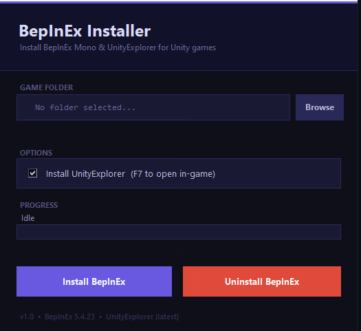

# Zeri Mod Manager

> BepInEx installer for Unity 2022 Mono games.


## Features
- Automatic install
- Plugin support
- Lightweight
- Unity Explorer


## Photo
> Might be old 




## Installation

1. Download release
2. Run installer
3. Select game folder
4. Press install

# How To Check If Your Game Uses Mono

Zeri Mod Manager only supports **Unity Mono** games **for now**.

Use the methods below to check your game type before installing.

---

## Method 1 — Look For `Managed`

Open your game folder and navigate to:

```txt
GAME-NAME_Data/
```

If you see a folder called:

```txt
Managed
```

the game is usually a **Mono** build.

### Example

```txt
MyGame/
├── MyGame.exe
└── MyGame_Data/
    └── Managed/
```

---

## Method 2 — Look For `MonoBleedingEdge`

Many Unity Mono games also contain:

```txt
MonoBleedingEdge
```

Example:

```txt
MyGame/
├── MonoBleedingEdge/
├── MyGame.exe
└── MyGame_Data/
    └── Managed/
```

If your game has BOTH:

- `Managed`
- `MonoBleedingEdge`

then it is almost certainly a **Mono** game.

---

## Method 3 — Check For `GameAssembly.dll`

If your game folder contains:

```txt
GameAssembly.dll
```

the game is usually **IL2CPP**.

### Example

```txt
MyGame/
├── GameAssembly.dll
├── MyGame.exe
└── MyGame_Data/
```

IL2CPP games are NOT currently supported by Zeri Mod Manager.

---

# Quick Reference

| Type | Usually Contains |
|------|------------------|
| Mono | `Managed` |
| Mono | `MonoBleedingEdge` |
| IL2CPP | `GameAssembly.dll` |

---

# Supported By Zeri Mod Manager

| Game Type | Supported |
|------------|------------|
| Unity Mono | ✔ Yes |
| Unity IL2CPP | ✘ No |

Soon, Zeri Mod Manager will support IL2CPP games, but for now, only Mono games :(

## Acknowledgements

 - [UnityExplorer Link](https://github.com/sinai-dev/UnityExplorer/)
 - [BepInEx Link](https://github.com/BepInEx/BepInEx/)

